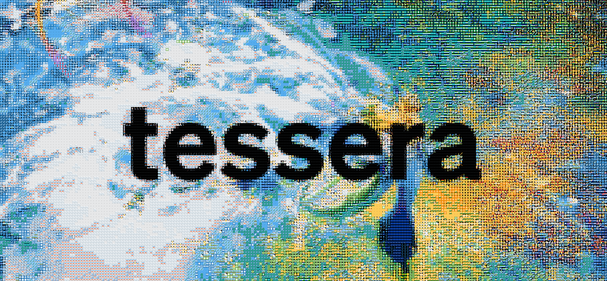
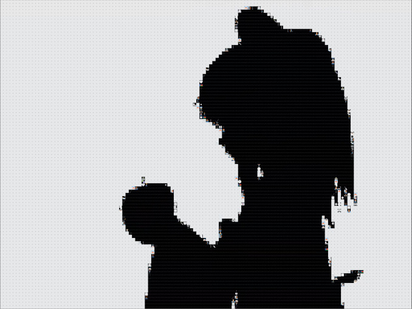
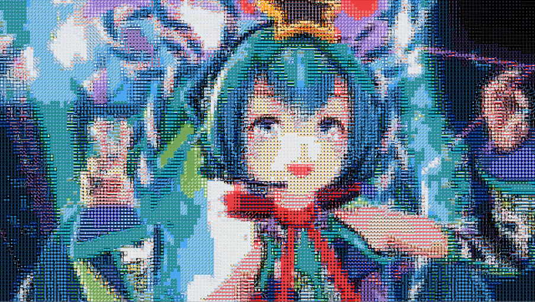
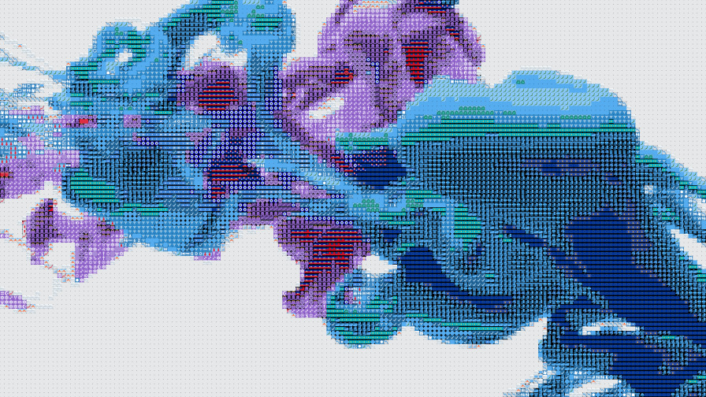
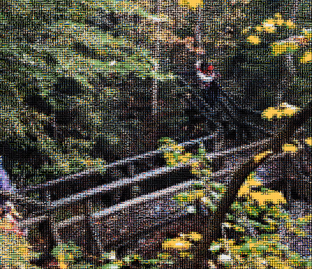

`tessera` is a CLI-based image mosaic generator. This tool transforms an input image by mapping each pixel to a tile image from a palette.

## Installation

1. Make sure Rust and Cargo are [installed](https://www.rust-lang.org/tools/install)
2. Run `cargo install --path .` (assuming the current working directory is the parent of this README)
3. You're done!

## How to use this tool

`tessera` is a command line program that accepts several arguments:

- `-h`, `--help`: print a list of arguments and their descriptions
- `-p`, `--palette-dir`: path to directory containing images to tile the output image with
- `-s`, `--tile-size`: width and height of each tile in the output image, in pixels
- `-i`, `--input`: input image path; input will be read from this location
- `-o`, `--output`: output image path; output will be written to this location

Note that, with a sufficiently large tile size and input image dimensions, the output image can be impractically large. Consider using a tool such as [ImageMagick](https://github.com/ImageMagick/ImageMagick) or [FFmpeg](https://www.ffmpeg.org) to downscale the input image before processing with `tessera`.

## Video showcases

The following examples demonstrate `tessera` used on videos. Frames were extracted from each video via FFmpeg, transformed using [Twemoji v15.1](https://github.com/jdecked/twemoji) as the palette, and stitched back together via FFmpeg.

|  |                     |  |  |
| :----------------------------------------------------------------------: | :-----------------------------------------------------------------------------------------: | :-------------------------------------------------------------------------: | :------------------------------------------------------------------------: |
|        [Bad Apple!!](https://www.youtube.com/watch?v=kZYjSlEJ_fo)        | [ラッキー☆オーブ feat. 初音ミク by emon(Tes.)](https://www.youtube.com/watch?v=ouFhezF-LNY) |         [Ink in water](https://www.youtube.com/watch?v=Hhv9BSlUd6g)         |         [Nature walk](https://www.youtube.com/watch?v=nzEnCIawkmM)         |

## License

This project is licensed under the MIT license; see [LICENSE](LICENSE) or https://opensource.org/licenses/MIT.

## Acknowledgements

The banner background was created from an illustration by [Haku](https://www.pixiv.net/artworks/115769268).
